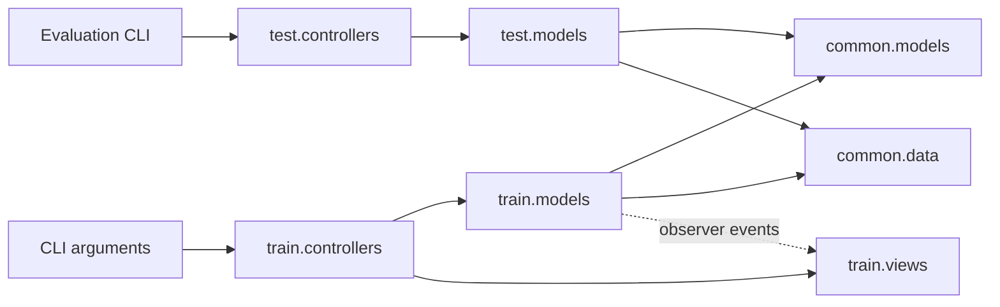
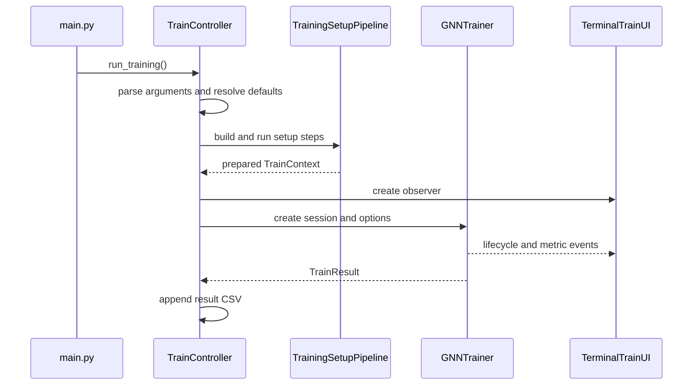

# Feature-First MVC

The repository is organized by feature first (`train`, `test`, `common`) and
by MVC responsibility inside each feature.

```text
src/
├── train/
│   ├── controllers/    CLI input, defaults, pipeline composition, run command
│   ├── models/         config, context, pipeline, trainer, steps, result types
│   └── views/          terminal observer and progress rendering
├── test/
│   ├── controllers/    evaluation CLI and input defaults
│   └── models/         evaluation config, evaluator, analysis toolkit
└── common/
    ├── models/         PPI graph, GNNGL-PPI, fusion, local encoders, losses
    └── data/           datasets, parsing, graph extraction, reporting, MASSA
```

## MVC dependency flow



## Training sequence



The Model owns training state and behavior. The Controller translates CLI
input into model operations and composes the workflow. The View never starts
training; it only renders observer events emitted by the model.
