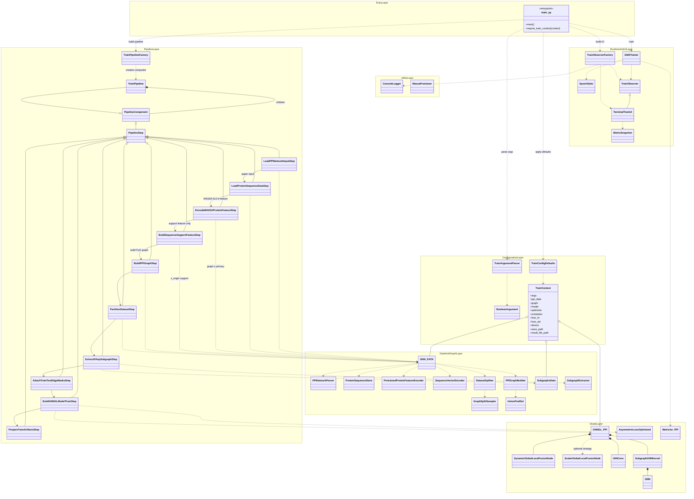
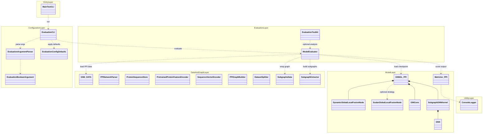

# Class Diagram

Two large diagrams show the current class-based architecture by layer. The train and test flows are separated to keep each graph readable.

## Train Flow

```mermaid
classDiagram
    direction TB

    namespace EntryLayer {
        class main_py {
            <<entrypoint>>
            +main()
            +require_train_context(context)
        }
    }

    namespace ConfigurationLayer {
        class BooleanArgument
        class TrainArgumentParser
        class TrainConfigDefaults
        class TrainContext {
            +args
            +ppi_data
            +graph
            +model
            +optimizer
            +scheduler
            +loss_fn
            +loss_asl
            +device
            +save_path
            +result_file_path
        }
    }

    namespace PipelineLayer {
        class PipelineComponent
        class PipelineStep
        class TrainPipeline
        class TrainPipelineFactory
        class LoadPPINetworkInputStep
        class LoadProteinSequenceDataStep
        class EncodeMASSAProteinFeatureStep
        class BuildSequenceSupportFeatureStep
        class BuildPPIGraphStep
        class PartitionDatasetStep
        class ExtractKHopSubgraphStep
        class AttachTrainTestEdgeMasksStep
        class BuildGNNGLModelTrainStep
        class PrepareTrainArtifactsStep
    }

    namespace RuntimeAndUILayer {
        class GNNTrainer
        class EpochStats
        class TrainObserver
        class TerminalTrainUI
        class TrainObserverFactory
        class MetricSnapshot
    }

    namespace DataAndGraphLayer {
        class GNN_DATA
        class PPINetworkParser
        class ProteinSequenceStore
        class PretrainedProteinFeatureEncoder
        class SequenceVectorEncoder
        class PPIGraphBuilder
        class DatasetSplitter
        class SubgraphsData
        class SubgraphExtractor
        class GraphSplitSampler
        class UnionFindSet
    }

    namespace ModelLayer {
        class GNNGL_PPI
        class DynamicGlobalLocalFusionNode
        class ScalarGlobalLocalFusionNode
        class GINConv
        class SubgraphGNNKernel
        class GNN
        class AsymmetricLossOptimized
        class Metrictor_PPI
    }

    namespace UtilityLayer {
        class ConsoleLogger
        class MassaPretrainer
    }

    main_py ..> TrainArgumentParser : parse args
    main_py ..> TrainConfigDefaults : apply defaults
    main_py ..> TrainPipelineFactory : build pipeline
    main_py ..> TrainObserverFactory : build UI
    main_py ..> GNNTrainer : train

    TrainArgumentParser ..> BooleanArgument
    TrainConfigDefaults ..> TrainContext

    PipelineComponent <|-- PipelineStep
    PipelineComponent <|-- TrainPipeline
    TrainPipeline *-- PipelineComponent : children
    TrainPipelineFactory ..> TrainPipeline : creates composite
    PipelineStep <|-- LoadPPINetworkInputStep
    PipelineStep <|-- LoadProteinSequenceDataStep
    PipelineStep <|-- EncodeMASSAProteinFeatureStep
    PipelineStep <|-- BuildSequenceSupportFeatureStep
    PipelineStep <|-- BuildPPIGraphStep
    PipelineStep <|-- PartitionDatasetStep
    PipelineStep <|-- ExtractKHopSubgraphStep
    PipelineStep <|-- AttachTrainTestEdgeMasksStep
    PipelineStep <|-- BuildGNNGLModelTrainStep
    PipelineStep <|-- PrepareTrainArtifactsStep

    LoadPPINetworkInputStep --> LoadProteinSequenceDataStep : paper input
    LoadProteinSequenceDataStep --> EncodeMASSAProteinFeatureStep : MASSA 512-d feature
    EncodeMASSAProteinFeatureStep --> BuildSequenceSupportFeatureStep : support feature only
    BuildSequenceSupportFeatureStep --> BuildPPIGraphStep : build PyG graph
    BuildPPIGraphStep --> PartitionDatasetStep
    PartitionDatasetStep --> ExtractKHopSubgraphStep
    ExtractKHopSubgraphStep --> AttachTrainTestEdgeMasksStep
    AttachTrainTestEdgeMasksStep --> BuildGNNGLModelTrainStep
    BuildGNNGLModelTrainStep --> PrepareTrainArtifactsStep

    LoadPPINetworkInputStep ..> GNN_DATA
    LoadProteinSequenceDataStep ..> GNN_DATA
    EncodeMASSAProteinFeatureStep ..> GNN_DATA : graph.x primary
    BuildSequenceSupportFeatureStep ..> GNN_DATA : x_origin support
    BuildPPIGraphStep ..> GNN_DATA
    PartitionDatasetStep ..> GNN_DATA
    ExtractKHopSubgraphStep ..> SubgraphsData
    ExtractKHopSubgraphStep ..> SubgraphExtractor
    BuildGNNGLModelTrainStep ..> GNNGL_PPI
    BuildGNNGLModelTrainStep ..> AsymmetricLossOptimized

    TrainContext o-- GNN_DATA
    TrainContext o-- SubgraphsData
    TrainContext o-- GNNGL_PPI

    GNNTrainer ..> EpochStats
    GNNTrainer ..> TrainObserver
    GNNTrainer ..> Metrictor_PPI
    GNNTrainer ..> ConsoleLogger
    TrainObserver <|-- TerminalTrainUI
    TrainObserverFactory ..> TrainObserver
    TrainObserverFactory ..> TerminalTrainUI
    TerminalTrainUI ..> MetricSnapshot

    GNN_DATA ..> PPINetworkParser
    GNN_DATA ..> ProteinSequenceStore
    GNN_DATA ..> PretrainedProteinFeatureEncoder
    GNN_DATA ..> SequenceVectorEncoder
    GNN_DATA ..> PPIGraphBuilder
    GNN_DATA ..> DatasetSplitter
    DatasetSplitter ..> GraphSplitSampler
    PPIGraphBuilder ..> UnionFindSet

    GNNGL_PPI *-- DynamicGlobalLocalFusionNode
    GNNGL_PPI ..> ScalarGlobalLocalFusionNode : optional strategy
    GNNGL_PPI *-- GINConv
    GNNGL_PPI *-- SubgraphGNNKernel
    SubgraphGNNKernel *-- GNN
```

## Test Flow

```mermaid
classDiagram
    direction TB

    namespace EntryLayer {
        class MainTestCLI
    }

    namespace ConfigurationLayer {
        class EvaluationBooleanArgument
        class EvaluationArgumentParser
        class EvaluationConfigDefaults
        class EvaluationCLI
    }

    namespace EvaluationLayer {
        class ModelEvaluator
        class EvaluationToolkit
    }

    namespace DataAndGraphLayer {
        class GNN_DATA
        class PPINetworkParser
        class ProteinSequenceStore
        class PretrainedProteinFeatureEncoder
        class SequenceVectorEncoder
        class PPIGraphBuilder
        class DatasetSplitter
        class SubgraphsData
        class SubgraphExtractor
    }

    namespace ModelLayer {
        class GNNGL_PPI
        class DynamicGlobalLocalFusionNode
        class ScalarGlobalLocalFusionNode
        class GINConv
        class SubgraphGNNKernel
        class GNN
        class Metrictor_PPI
    }

    namespace UtilityLayer {
        class ConsoleLogger
    }

    MainTestCLI ..> EvaluationCLI : run
    EvaluationCLI ..> EvaluationArgumentParser : parse args
    EvaluationCLI ..> EvaluationConfigDefaults : apply defaults
    EvaluationCLI ..> ModelEvaluator : evaluate
    EvaluationArgumentParser ..> EvaluationBooleanArgument

    ModelEvaluator ..> GNN_DATA : load PPI data
    ModelEvaluator ..> SubgraphsData : wrap graph
    ModelEvaluator ..> SubgraphExtractor : build subgraphs
    ModelEvaluator ..> GNNGL_PPI : load checkpoint
    ModelEvaluator ..> Metrictor_PPI : score output
    EvaluationToolkit ..> ModelEvaluator : optional analysis

    GNNGL_PPI *-- DynamicGlobalLocalFusionNode
    GNNGL_PPI ..> ScalarGlobalLocalFusionNode : optional strategy
    GNNGL_PPI *-- GINConv
    GNNGL_PPI *-- SubgraphGNNKernel
    SubgraphGNNKernel *-- GNN
    Metrictor_PPI ..> ConsoleLogger
```
